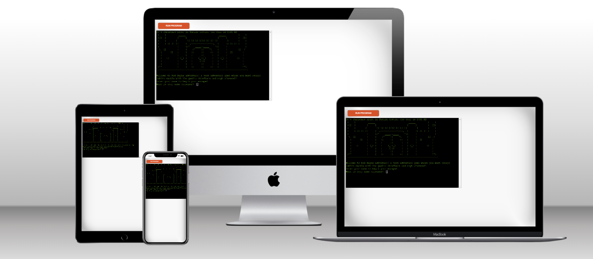

# Red Hugh's Adventure

Red Hugh's Adventure is a Python terminal adventure game which runs in the Code Institute's mock terminal on Heroku.

Players must navigate their way through Dublin castle and escape through an exit while solving puzzles along the way. 

You can find the live site [Here](https://red-hughs-adventure.herokuapp.com/).
####

&nbsp;

# Purpose
I built this website as my third project for the code institutes full stack development and e-commerce applications course. 
I built this website from scratch using the knowledge I gained from the course where I studied the basics of Python.

## How to play
* This game is constructed like a traditional text adventure game where the player is asked to input what direction he would like to head. 

* For example head north for kitchen, head south for bedroom and head east for bathroom.

* Once the desired input is entered the player will arrive there and be allowed to return to previous locations with items picked up from other ones.

* Items acquired through visiting new locations and solving puzzles are vital to the player's progress and will allow he/she to escape and complete the game. 

* If a player is caught or killed by the guards he will fail the game and be offered another attempt. 

## Features 

* The game features 10 different rooms / areas to explore some are possible to return to while others such as the area you began in, are not.

* The player is given multiple choices to explore a different direction in each room / area they venture into. 

* The game accepts user input to move direction and tells the player to enter which word to go which direction. 

* User input can also determine whether the player wants to undertake a certain task or pick up an object. 

* Validation is implemented on every choice the player can make, if a player enters something other than the game requested, they will be met with text that is coloured red to tell them the only options they can enter to proceed. 

* If the player is caught by the guards or kills he will lose, the game will then offer them another chance to play again or to exit the game entirely. 

* The delay print function makes the text print out slowly as if it is just appearing on screen one letter at a time mimicking text adventure games which were popular in the 1980's.

* The text's green color is also chosen to make the game seem like a terminal adventure game from the past, it gives the game a retro and authentic feel.

* To differentiate between each room unique ASCII art is added to each one and give the game a better design. 

* A progress bar which simulates a new area rendering is added to the bottom of each area when the player inputs which direction he would like to go 

## Future Features 

* An OOP combat system when facing the guards 
* Allow players to interact with their fellow prisoner Red Hugh and find out more about him. 