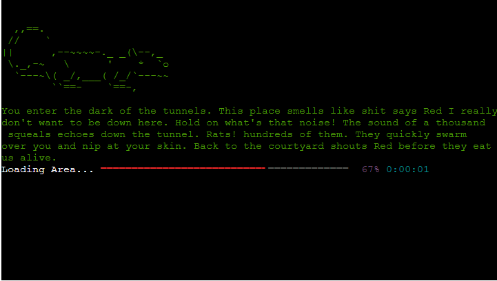
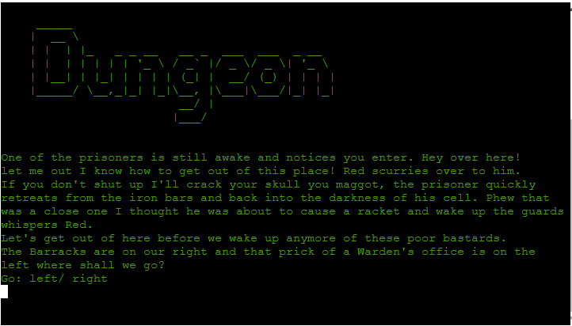
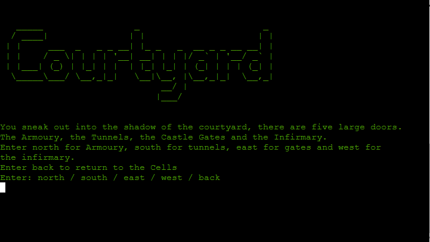
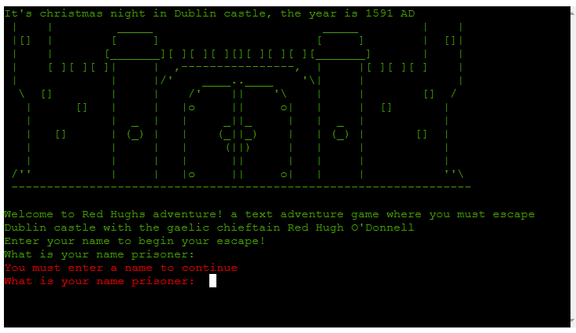
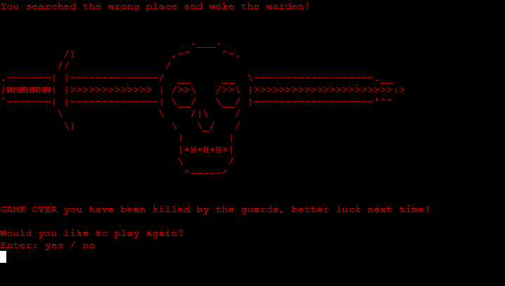

# Red Hugh's Adventure

Red Hugh's Adventure is a Python terminal adventure game which runs in the Code Institute's mock terminal on Heroku.

Players must navigate their way through Dublin castle and escape through an exit while solving puzzles along the way. 

You can find the live site [Here](https://red-hughs-adventure.herokuapp.com/).
####

&nbsp;

# Purpose
I built this website as my third project for the code institutes full stack development and e-commerce applications course. 
I built this website from scratch using the knowledge I gained from the course where I studied the basics of Python.

## How to play
* This game is constructed like a traditional text adventure game where the player is asked to input what direction they would like to head. 

* For example head north for kitchen, head south for bedroom and head east for bathroom.

* Once the desired input is entered the player will arrive there and be allowed to return to previous locations with items picked up from other ones.

* Items acquired through visiting new locations and solving puzzles are vital to the player's progress and will allow he/she to escape and complete the game. 

* If a player is caught or killed by the guards they will fail the game and be offered another attempt. 

## Features 

1.  The game features 10 different rooms / areas to explore some are possible to return to while others such as the area you began in, are not.

Different Areas

 

2.  The player is given multiple choices to explore a different direction in each room / area they venture into. 

3. The game accepts user input to add their name, which is referenced throughout and to move direction and tells the player to enter which word to go which direction. 

Multiple choices for navigation

 

4. User input can also determine whether the player wants to undertake a certain task or pick up an object. 

Choice of task

 

5. Validation is implemented on every choice the player can make, if a player enters something other than the game requested, they will be met with text that is coloured red to tell them the only options they can enter to proceed. 

Input validation

 

6. If the player is caught or killed by the guards he will lose, the game will then offer them another chance to play again or to exit the game entirely. 

Game over

 

7. The delay print function makes the text print out slowly as if it is just appearing on screen one letter at a time mimicking text adventure games which were popular in the 1980's.

8. The text's green color is also chosen to make the game seem like a terminal adventure game from the past, it gives the game a retro and authentic feel.

9. To differentiate between each room unique ASCII art is loaded on entering giving the game a better design. 

10. A progress bar which simulates a new area rendering is added to the bottom of each area when the player inputs which direction he would like to go. 

Loading area bar

 

## Future Features 

* An OOP combat system when facing the guards 
* Allow players to interact with their fellow prisoner Red Hugh and find out more about him. 
 

# Design 

## Issues with design

* Orginally each areas script and ASCII art was loaded with a simple print function but this proved to be too messy and left the code readability very poor along with making it very hard to maintain. I then created two dictionaries to pull the scripts and images from. 
 

* To keep the player from having to enter the intro section and have to read the script once again I removed it after the intro sequence was done. Bypassing the intro and having them go straight from the courtyard to the dungeon and vice versa. 
 

* To save me printing out the script and image to be loaded in each scene I created the display_scene() function in which I could pass the dictionary key's in as parameters, making my code even more readable and easier to maintain. 

# Bugs 

* Originally was getting errors in the Heroku Terminal as I had not added Textualize rich and Colorama to the requirements.txt file, adding them to the file quickly fixed this. 
 

* The game would load the return from the castle gates with no key function even when the player had pickpocketed the key successfully, I soon realized I had not initialized the key as a global variable. 
 

* No bugs remained after this. 
 